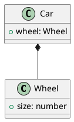

# tplant

> Typescript to UML (PlantUML)

Will convert a Typescript file to UML diagram. Following all inheritances.

[](https://travis-ci.com/Jeff-Tian/tplant)
[](https://codecov.io/gh/Jeff-Tian/tplant)
[](https://ci.appveyor.com/project/Jeff-Tian/tplant)
[](https://gitmoji.js.org)

[](https://sonarcloud.io/dashboard?id=Jeff-Tian_tplant)

## Usage

### Install

```shell
npm install --global @jeff-tian/tplant
```

### Generate image file (svg or png)

```shell
tplant --input test/Playground/**/*.ts --output test/Playground/Playground.svg
tplant --input test/Playground/Classes/Greeter.ts --output test/Playground/Classes/Greeter.png
```

> Internet connection is required

### Generate puml file

```shell
tplant --input test/Playground/**/*.ts --output test/Playground/Playground.puml
tplant --input test/Playground/Classes/Greeter.ts --output test/Playground/Classes/Greeter.puml
```

## Options

### -i, --input <path>

    Define the path of the Typescript file

### -o, --output <path>

    Define the path of the output file. If not defined, it'll output on the STDOUT

### -p, --project <path>

    Compile a project given a valid configuration file.
    The argument can be a file path to a valid JSON configuration file, or a directory path to a directory containing a tsconfig.json file.

### -C, --compositions

    Create not heritage compositions.
    Example:

```typescript
class Wheel {
  public size: number;
}
class Car {
  public wheel: Wheel;
}
```



### -I, --only-interfaces

    Only convert interfaces

# References

https://github.com/Microsoft/TypeScript/wiki/Using-the-Compiler-API
